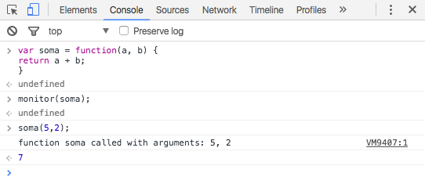

# Debugando sua Web App utilizando o Chrome Developer Tools

## Logando dados tabulares

* console.table

Com o console.table, podemos imprimir no Console dados como uma tabela. Ótimo para logar uma resposta de uma API. Poderíamos imprimir de uma forma mais fácil de visualizar a resposta da API da seguinte forma:

```js
$.get("https://api.github.com/search/repositories?q=tetris")
  .done(function(response) {
    console.table(response.items);
  });
```

É possível escolher quais campos serão mostrados. Passe um array como segundo argumento informando quais chaves dos objetos serão mostradas, como no exemplo a seguir.

```js
$.get("https://api.github.com/search/repositories?q=tetris")
  .done(function(response) {
    console.table(response.items, ["full_name", "description"]);
  });
```

## Imprimindo a stack trace
* console.trace

Isso é muito útil se usado no lugar correto. Ele imprime a stack trace do ponto onde foi chamado, incluindo links para as linhas dos devidos arquivos JavaScript.

## Listando todos os *event listeners*
* getEventListeners

Esta função retorna todos os event listeners do objeto passado como parâmetro. É uma mão na roda na hora de debugar código.

```js
// Retorna uma lista com todos os event listeners do elemento document
getEventListeners(document);
```

## Listando todas as regras CSS de um elemento
* getMatchedCssRules

Retorna uma lista de todas as regras CSS que estão sendo aplicadas no objeto passado como parâmetro.

```js
// Retorna uma lista com todas as regras CSS aplicadas ao elemento <body>
getMatchedCSSRules(document.querySelector("body"));
```

## Monitorar chamadas a uma função
* monitor

Monitora todas as chamadas à função passada como parâmetro. Toda vez que a função `monitor(fn)` for chamada, esta chamada é logada no Console mostrando o nome da função, parâmetros e seus valores.



A função unmonitor desliga o monitoramento na função passada como parâmetro.

## Monitorando eventos
* monitorEvents

Quando algum dos eventos especi cados acontece no objeto passado como parâmetro, o objeto Event é logado. Caso não seja especi cado nenhum parâmetro, todos os eventos serão escutados.

Para filtrar quais eventos serão monitorados, passe como segundo parâmetro um array com uma lista dos mesmos.

```js
// Monitorando apenas os eventos click, resize e scroll
monitorEvents(window, ["click", "resize", "scroll"]);
```

Também é possível especificar tipos de eventos, que funcionam como grupos predefinidos de eventos. Os tipos disponíveis são:

* **mouse**: mousedown, mouseup, click, dblclick, mousemove, mouseover, mouseout, mousewheel;

* **key**: keydown, keyup, keypress, textInput;

* **touch**: touchstart, touchmove, touchend, touchcancel;

* **control**: resize, scroll, zoom, focus, blur, select, change, submit, reset.

A função unmonitorEvents desliga o monitoramento na função passada como parâmetro.

## *Breakpoint* em uma função

* debug

Adiciona um breakpoint na primeira linha da função passada como parâmetro. Com esse método,  ca mais fácil debugar uma função sobre a qual não sabemos em que arquivo ela está implementada.


	Fonte: E-book "Coletâne Front-end - Uma Antologia da Comunidade Front-end Brasileira"