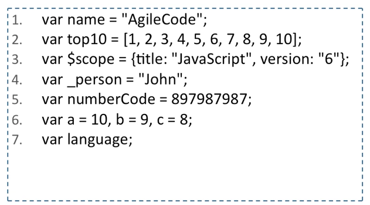

# Aula 01 - Introdução

- Javascript é uma das linguagens mais populares do mundo! 

- Com a maior quantidade de ferramentas. 

- Isso se deve por ela ser a linguagem que está nos browsers. 

- É possível desenvolver aplicações para as mais diversas plataformas. 

- Boa parte dos problemas das pessoas com a linguagem tem relação direta com a **DOM**, e *não com a linguagem*

- "A linguagem JavaScript é a única que as pessoas acham que não precisam aprender antes de começar a utilizar" (Douglas Crockford)

	* O problema é que ela utiliza conceitos bem diferentes das outas linguagens que estamos acostumados!

## DOM (Document Object Model)

- É a API que todos os browser trazem consigo.

- A DOM foi padronizada pela W3C em 1998 para representar documentos escritos em HTML, XHTML e XML.

- Por meio dessa API, é possível acessar e manipular qualquer informação do documento.

## Javascript

- O Javascript nasceu inspirada em outra linguagem de programação chamada HyperTalk desenvolvida pela Apple.

	* Extremamente amigável para iniciantes.

- A Netscape teve a ideia de implementar um conceito semelhante. 

- Então a Netscape contratou Brendan Eich para essa difícil missão.

- Brendan Eich é o criador da linguagem Javascript.

- Com base no público alvo, a linguagem precisava ser baseada em algo mais popular, como o Java. 

- Brendan Eich utilizou como base as linguagens **Java**, **Scheme** e **Self** e com algumas influências de **Perl**.

### Raízes do Javascript

- Seu primeiro nome foi **Mocha**, por sugestão de Marc Andreessen, fundador da Netscape.

- A linguagem foi lançada oficialmente em Setembro de 1995 com o nome de **LiveScript** na versão  beta do Netscape Navigator 2.0

- Em Dezembro, o nome da linguagem mudou para **JavaScript**, a partir de um acordo feito com a Sun com o objetivo de destruir a Microsoft.

- O nome Javascript, foi registrado como uma marca pertencente a Sun e era de uso exclusivo da Netscape.

- A Microsoft fez uma engenharia reversa da linguagem da Netscape, criando a linguagem JScript.

- Com medo de perder o controle, a Netscape busca uma série de entidades como a W3C e a ISO com o objetivo de padronizar a linguagem.

- Em 1997, apéos algumas tentativas, a Netscape conseguiu padronizar a linguagem junto com a ECMA Internacional, nomeando-a ECMAScript.

## Características da Linguagem

- A linguagem Javascript é interpretada
	* Não é preciso instalar nada para executá-la.

- Possui orientação a objetos baseada em protótipos, não possuindo classes.

- A linguagem possui tipagem fraca e dinâmica. 

- Além disso, possui funções de primeira classe.
	* São funções que podem ser atribuidas a variáveis e ser passadas como parâmetro e retornando de outras funções.

- A linguagem não apresenta suporte a programação multi-thread.

- Está atualmente na versão 6.0.

### Histórico de lançamento da linguagem

## Variáveis

- Tem uma declaração de variáveis com tipagem fraca. 

- A variáveis devem ser criadas seguindo as regras:

	* Devem começar por uma letra, $ ou _

	* Após a primeira letra, podem conter números

	* Pela convenção, começam com letra minúscula e usam camelCase

	* São case-sensitive

### Exemplo de declaração de variável

 

