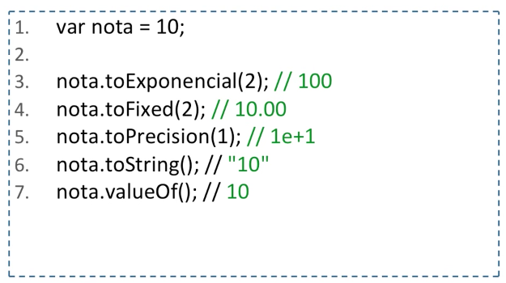
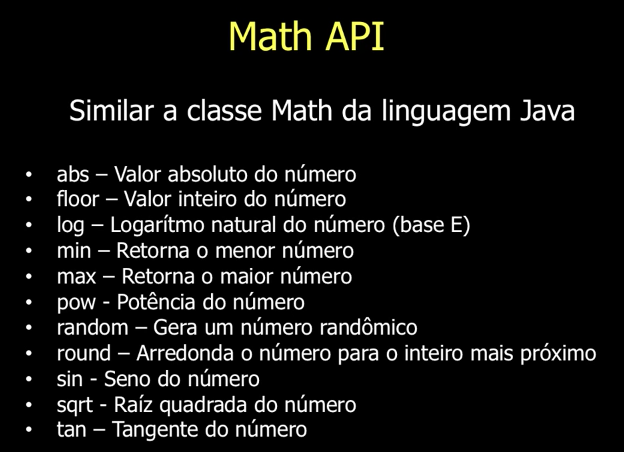

# Aula 02 - Tipos de Dados (Number)

## Number 

- Há apenas um tipo, o tipo number. 

- Só existe um tipo numérico na linguagem e ele tem as seguintes características:

	* IEEE-754 (Standard for Floating-Point)

	* binary64 ou Double Precision

### Criando um Number

## Math API

