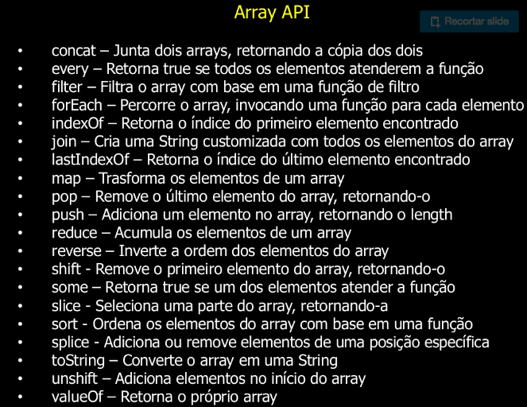

# Aula 09 - Array

## Array

- Não existem Arrays **de verdade** na linguagem Javascript

- Os Arrays em Javascript são apenas **objetos especiais** que oferecem meios para **acessar** e **manipular** suas propriedades por meio de índices.

## Criando um Array com []

```js
var carros = [];
```

## Inserindo elementos no Array

```js
var carros = [];

carros[0] = "Ka";
carros[1] = "Corsa";
carros[2] = "Palio";
```

## Também é possível criar um Array inicializado com elementos

```js
var carros = ["Ka", "Corsa", "Palio"];
```

## Criando um Array com new Array()

```js
var carros = new Array();

carros[0] = "Ka";
carros[1] = "Corsa";
carros[2] = "Palio";
```

## Inicializando o Array com elementos

```js
var carros = new Array("Ka", "Corsa", "Palio");
```

## Também é possível inicializar o Array, com um tamanho inicial

```js
var carros = new Array(10);
```
>Não se esqueça que o Array **não tem tamanho fixo** e o tamanho inicial é apenas uma forma de inicializá-lo.

## Array API



## Inserindo novos elementos no final com push

```js
var carros = [];

carros[0] = "Ka";
carros[1] = "Corsa";
carros[2] = "Palio"

carros.push("Gol"); //4

carros.toString(); // ["Ka", "Corsa", "Palio", "Gol"]
```

## Retirando elementos do final com pop

```js
var carros = [];

carros[0] = "Ka";
carros[1] = "Corsa";
carros[2] = "Palio";

carros.pop(); //"Palio"

carros.toString(); // ["Ka", "Corsa"]
```

## Inserindo novos elementos no início com unshift

```js
var carros = [];

carros[0] = "Ka";
carros[1] = "Corsa";
carros[2] = "Palio";

carros.unshift("Gol"); //4

carros.toString(); // ["Gol", "Ka", "Corsa", "Palio"]
```

## Retirando elementos do início com shift

```js
var carros = [];

carros[0] = "Ka";
carros[1] = "Corsa";
carros[2] = "Palio";

carros.shift(); // "Ka"

carros.toString(); // ["Corsa", "Palio"]
```

## Localizando elementos com indexOf

```js
var carros = [];

carros[0] = "Ka";
carros[1] = "Corsa";
carros[2] = "Palio";

carros.indexOf("Corsa"); //1
```

## Removendo elementos em uma posição com splice 

```js
var carros = [];

carros[0] = "Ka";
carros[1] = "Corsa";
carros[2] = "Palio";

var posicao = carros.indexOf("Corsa"); //1

carros.splice(posicao, 1); // ["Corsa"] | Segundo parâmetro diz respeito a quantos elementos queremos remover

carros.toString(); //["Ka", "Palio"]
```

## Substituindo elementos em uma posição com splice

```js
var carros = [];

carros[0] = "Ka";
carros[1] = "Corsa";
carros[2] = "Palio";

var posicao = carros.indexOf("Corsa"); //1

carros.splice(posicao, 1, "Gol"); // ["Corsa"]

carros.toString(); // ["Ka", "Gol", "Palio"]
```

## Adicionando elementos em uma posição com splice

```js
var carros = [];

carros[0] = "Ka";
carros[1] = "Corsa";
carros[2] = "Palio";

var posicao = carros.indexOf("Corsa"); //1

carros.splice(posicao, 0, "Gol"); // ["Corsa"] | O parâmetro 0 não remove ninguém e permite adicionar elementos.

carros.toString(); // ["Ka", "Gol", "Corsa", "Palio"] | Quando o elemento entra em uma posição ele empurra o outras para outras posições.
```

## Iterando um Array com forEach

```js
var carros = [];

carros[0] = "Ka";
carros[1] = "Corsa";
carros[2] = "Palio";

carros.forEach(function(elemento){
    // Lógica de iteração
});
```

## Iterando um Array com for 

```js
var carros = [];

carros[0] = "Ka";
carros[1] = "Corsa";
carros[2] = "Palio";

for(var i=0; i < carros.length; i++){
    console.log(carros[i]);
}

// Ka, Corsa, Palio
```

## Filtrando o Array com filter

```js
var carros = [];

carros[0] = {marca: "Ford", modelo: "Ka"};
carros[1] = {marca: "Chevrolet", modelo: "Corsa"};
carros[2] = {marca: "Fiat", modelo: "Palio"};

var carrosFord = carros.filter(function(elemento){
    return elemento.marca === "Ford";
});

carrosFord // [{marca: "Ford", modelo: "Ka"}]
```

## Filtrando o Array na forma clássica

```js
var carros = [];

carros[0] = {marca: "Ford", modelo: "Ka"};
carros[1] = {marca: "Chevrolet", modelo: "Corsa"};
carros[2] = {marca: "Fiat", modelo: "Palio"};

var carrosFord = [];

carros.forEach(function(elemento){
    if(elemento.marca === "Ford"){
        carrosFord.push(elemento);
    }
});
carrosFord // [{marca: "Ford", modelo: "Ka"}]
```

## Testando os elementos do Array com every
>Verificando se todos os elementos são de um tipo especificado/atende a condição

```js
var carros = [];

carros[0] = {marca: "Ford", modelo: "Ka"};
carros[1] = {marca: "Chevrolet", modelo: "Corsa"};
carros[2] = {marca: "Fiat", modelo: "Palio"};

carros.every(function(elemento){
    return elemento.marca === "Ford";
});

// false
```

## Testando os elementos do Array com some
>Verifica se algum dos elementos é so tipo específicado/atende a condição

```js
var carros = [];

carros[0] = {marca: "Ford", modelo: "Ka"};
carros[1] = {marca: "Chevrolet", modelo: "Corsa"};
carros[2] = {marca: "Fiat", modelo: "Palio"};

carros.some(function(elemento){
    return elemento.marca === "Ford";
});

// true
```

## Mapeando os elementos do Array com map
>Retorna um novo array derivado

```js
var carros = [];

carros[0] = {marca: "Ford", modelo: "Ka"};
carros[1] = {marca: "Chevrolet", modelo: "Corsa"};
carros[2] = {marca: "Fiat", modelo: "Palio"};

carros.map(function(elemento){
    return elemento.marca;
});

// ["Ford", "Chevrolet", "Corsa"]
```

### Descobrir a quantidade de caracteres que existe em cada modelo de carro

```js
var carros = [];

carros[0] = {marca: "Ford", modelo: "Ka"};
carros[1] = {marca: "Chevrolet", modelo: "Corsa"};
carros[2] = {marca: "Fiat", modelo: "Palio"};

carros.map(function(elemento){
    return elemento.modelo.length;
});

// [2, 5, 5]
```

## Processando os elementos do Array com reduce

```js
var carros = [];

carros[0] = {marca: "Ford", preco: 28800};
carros[1] = {marca: "Chevrolet", preco: 34750};
carros[2] = {marca: "Fiat", preco: 32000};

carros.reduce(function(prev, current){ // prev = valor atual
    return prev + current.preco;
},0); // 0 determina o valor inicial 

// 95550
```

## Processando os elementos na forma clássica

```js
var carros = [];

carros[0] = {marca: "Ford", preco: 28800};
carros[1] = {marca: "Chevrolet", preco: 34750};
carros[2] = {marca: "Fiat", preco: 32000};

var total = 0;

carros.forEach(function(elemento){
    total += elemento.preco;
});

total
// 95550
```

## Concatenando dois Arrays com concat
>concat não muda o estado original do Array, concat gera um novo Array.

```js
var carros = ["Ka", "Corsa", "Palio"];
var motos = ["Honda", "Yamaha"];

var veiculos = carros.concat(motos);

veiculos.toString(); // ["Ka", "Corsa", "Palio", "Honda", "Yamaha"]
```

## Fatiando um Array com slice

```js
var carros = [];

carros[0] = "Ka";
carros[1] = "Corsa";
carros[2] = "Palio";
carros[3] = "Gol";

carros.slice(0,2) // ["Ka", "Corsa"]
carros.slice(1,3) // ["Corsa", "Palio"]
carros.slice(2) // ["Palio", "Gol"] | Se não definir a posição final ele vai trazer todos a partir da posição inicial.
```

## Invertendo a ordem de um Array com reverse
>O reverse altera o Array original

```js
var carros = [];

carros[0] = "Ka";
carros[1] = "Corsa";
carros[2] = "Palio";
carros[3] = "Gol";

carros.reverse();

carros.toString(); // ["Gol", "Palio", "Corsa", "Ka"] | Para retornar para o estado original basta usar novamente o reverse().
```

## Ordenando os elementos de um Array com sort

```js
carros[0] = {marca: "Ford", preco: 28800};
carros[1] = {marca: "Chevrolet", preco: 34750};
carros[2] = {marca: "Fiat", preco: 32000};

carros.sort(function(a,b){
    return a.preco - b.preco;
});

/*[
carros[0] = {marca: "Ford", preco: 28800};
carros[2] = {marca: "Fiat", preco: 32000};
carros[1] = {marca: "Chevrolet", preco: 34750};
] */

carros.sort(function(a,b){
    return b.preco - a.preco;
});

/*[
carros[1] = {marca: "Chevrolet", preco: 34750};
carros[0] = {marca: "Ford", preco: 28800};
carros[2] = {marca: "Fiat", preco: 32000};
] */
```

## Juntando os elementos de um Array com join
>O resultado é uma string separada pelo parâmetro definido

```js
var carros = [];

carros[0] = "Ka";
carros[1] = "Corsa";
carros[2] = "Palio";
carros[3] = "Gol";

carros.join(";");

// "Ka;Corsa;Palio;Gol"

carros.join(";").split(";");

// ["Ka", "Corsa", "Palio", "Gol"]
```