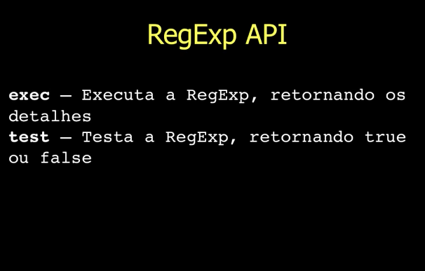
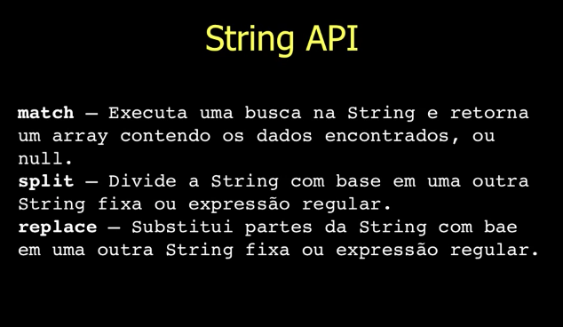

# Aula 10 - Expressões Regulares

## Expressões Regulares

As expressões regulares são estruturas formadas por uma **sequência de caracteres que especificam um padrão formal** que é muito útil para:

- Validação de campos
- Extração de dados
- Substituição de caracteres em textos

### Criando um expressão regular

```js
var regExp = /<expressão regular>/; // Primeira opção

var regExp = new RegExp("<expressão regular>"); // Segunda opção
```

## RegExp API



## 12 passos para aprender Expressões Regulares

### Telefone - Passo 1

>Nosso primeiro exemplo envolve o reconhecimento de um telefone simples: 9999-9999. Esse telefone será evoluído por meio de novos cenários para estimular a utilização de grupos, metacarecteres, quantificadores e muito mais!

```js
var regExp = /9999-9999/;
var telefone = "9999-9999";

regExp.exec(telefone); // ['9999-9999', index: 0, input: '9999-9999']
```

```js
var regExp = /9999-9999/;
var telefone = "9999-9999";

regExp.test(telefone); // true
```

### Telefone - Passo 2

>Evoluímos nosso primeiro exemplo e agora o telefone tem código de área (48) 9999-9999, como fazer para reconhecê-lo?

Neste cenário o test retornaria false, pois há dentro do regex alguns caracteres especiais, como a parenteses. Neste caso, precisamos utilizar um "escape" capaz de escapar os caracteres especiais.

- Escapando caracteres especiais

\ - A barra é utilizada antes de caracteres especiais, com o objetivo de escapá-los.

Como isso seria resolvido?

```js
var regExp = /\(48\) 9999-9999/;
var telefone = "(48) 9999-9999";

regExp.test(telefone); // true
```

### Telefone - Passo 3

>Vamos evoluir novamente e agora, no nosso terceiro exemplo, temos que fazer com que o telefone seja reconhecido únicamente, não permitindo outros caracteres antes e depois!

```js
var regExp = /\(48\) 9999-9999/;
var telefone = "O telefone é (48) 9999-9999, tratar com João";

regExp.test(telefone); // true
```

O exemplo acima retorna true pois encontra o padrão da regex dentro da nossa string, mesmo ela contendo elementos a mais. Tanto que se utilizar o exec(), ele mostrará o index onde o elemento foi encontrado. 

```
[ '(48) 9999-9999',
  index: 13,
  input: 'O telefone é (48) 9999-9999, tratar com João' ]
```

- Como fazemos a operação dar false então?

Devemos utilziar alguns carateres que garantem que nosso elemento comece e finalize como determinarmos. Eles são:

^ - Inicia com um determinado caractere
$ - Finaliza com um determinado caractere

```js
var regExp = /^\(48\) 9999-9999/;
var telefone = "O telefone é (48) 9999-9999, tratar com João";

regExp.test(telefone); // false
```

Retorna false porque nossa string não começa de acordo como definimos. Para voltar a retornar true neste cenário devemos remover o conteúdo antes do número do telefone.

```js
var regExp = /^\(48\) 9999-9999/;
var telefone = "(48) 9999-9999, tratar com João";

regExp.test(telefone); // true
```

Por fim, se utilizarmos o $ para determinar o fim do nosso elemento, precisamos remover o restante do conteúdo da nossa string para que retorne true, caso contrário retornaria um false.

```js
var regExp = /^\(48\) 9999-9999$/;
var telefone = "(48) 9999-9999";

regExp.test(telefone); // true
```

### Telefone - Passo 4

>Chegou a hora de aceitar qualquer número de telefone, para precisamos flexibilizar a expressão regular por meio de grupos.

- Grupos de caracteres

[abc] - Aceita qualquer caractere dentro do grupo, nesse caso a, b e c.

[ˆabc] - Não aceita qualquer caractere dentro do grupo, nesse caso a, b e c. O ^ dentro de um grupo é a negação dele.

[0-9] - Aceita qualquer caractere entre 0 e 9. O - dentro do grupo significa que há um range.

[ˆ0-9] - Não aceita qualquer caractere entre 0 e 9. O ^ dentro de um grupo é a negação dele. 

- Utilizando grupos de caracteres

```js
var regExp = /^\([0-9][0-9]\) [0-9][0-9][0-9][0-9]-[0-9][0-9][0-9][0-9]$/;
var telefone = "(48) 9876-1234";

regExp.test(telefone); // true
```

### Telefone - Passo 5

>Não é muito grupo? Para evitar a repetição exagerada de padrões em uma expressão regular, podemos utilizar quantificadores.

- **Quantificadores - Parte 1**

Os quantificadores podem ser aplicados a caracteres, grupos, conjuntos ou metacaracteres.

{n}     - Quantifica um número específico

{n,}    - Quantifica um número mínimo

{n,m}   - Quantifica um número mínimo e um número máximo

```js
var regExp = /^\([0-9]{2}\) [0-9]{4}-[0-9]{4}$/;
var telefone = "(48) 9876-1234";

regExp.test(telefone); // true
```

### Telefone - Passo 6

>E se for necessário aceitar números com 8 ou 9 dígitos? Podemos utilizar um quantificador para especificar um determinado intervalo.

```js
var regExp = /^\([0-9]{2}\) [0-9]{4,5}-[0-9]{4}$/;
var telefone1 = "(48) 9876-1234";
var telefone2 = "(48) 99876-1234";

regExp.test(telefone1); // true
regExp.test(telefone1); // true
```

### Telefone - Passo 7

>E se o hífen for opcional? É muito comum que se escreva sem hífen! Podemos utilizar um quantificador para torná-lo opcional.

- **Quantificadore - Parte 2**

Os quantificadores podem ser aplicados a caracteres, grupos, conjuntos ou metacaracteres.

?   - Zero ou um

\*  - Zero ou mais

\+  - Um ou mais 

```js
var regExp = /^\([0-9]{2}\) [0-9]{4,5}-?[0-9]{4}$/;
var telefone1 = "(48) 9876-1234";
var telefone2 = "(48) 998761234";

regExp.test(telefone1); // true
regExp.test(telefone1); // true
```

### Telefone - Passo 8

>E se o telefone agora estiver em uma estrutura de tabela, como fazer para reconhecer cada linha?

```js
var regExp = /<table><tr>(<td>\([0-9]{2}\) [0-9]{4,5}-?[0-9]{4}<\/td>)+<\/tr><\/table>/;
var telefone = "<table><tr><td>(80) 999971111</td><td>(90) 99876-8877</td><td>(70) 9876-9999</td></tr></table>";

regExp.test(telefone); // true
```

### Telefone - Passo 9

>Em muitos casos, é possível substituir os grupos por metacaracteres especifícos!

- **Alguns Metacaracteres**

.   - Representa qualquer caractere

\w  - Representa o conjunto [a-zA-Z0-9_]

\W  - Representa o conjunto [ˆa-zA-Z0-9_]

\d  - Representa o conjunto [0-9]

\D  - Representa o conjunto [ˆ0-9]

\s  - Representa um espaço em branco

\S  - Representa um não espaço em branco

\n  - Representa uma quebra de linha

\t  - Representa um tab


```js
var regExp = /<table><tr>(<td>\(\d{2}\)\s\d{4,5}-?\d{4}<\/td>)+<\/tr><\/table>/;
var telefone = "<table><tr><td>(80) 999971111</td><td>(90) 99876-8877</td><td>(70) 9876-9999</td></tr></table>";

regExp.test(telefone); // true
```

## String API



### Telefone - Passo 10

>Chegou a hora de extrair os telefones das linhas das tabelas! Vamos extrair o telefone da primeira linha.

```js
var regExp = /\(\d{2}\)\s\d{4,5}-?\d{4}/;
var telefone = "<table><tr><td>(80) 999971111</td><td>(90) 99876-8877</td><td>(70) 9876-9999</td></tr></table>";

telefone.match(regExp); 
```

Resultado:

```
[ '(80) 999971111',
  index: 15,
  input: '<table><tr><td>(80) 999971111</td><td>(90) 99876-8877</td><td>(70) 9876-9999</td></tr></table>' ]
```

### Telefone - Passo 11

>Agora, vamos extrair o telefone de todas as linhas.

- **Modificadores**

i  - Case-insensitive matching

g  - Global matching

m  - Multiline matching

```js
var regExp = /\(\d{2}\)\s\d{4,5}-?\d{4}/g;
var telefone = "<table><tr><td>(80) 999971111</td><td>(90) 99876-8877</td><td>(70) 9876-9999</td></tr></table>";

telefone.match(regExp); 
```

Resultado:

```
[ '(80) 999971111', '(90) 99876-8877', '(70) 9876-9999' ]
```

### Telefone - Passo 12

>Por fim, vamos substituir todos os telefones da tabela!

```js
var regExp = /\(\d{2}\)\s\d{4,5}-?\d{4}/g;
var telefone = "<table><tr><td>(80) 999971111</td><td>(90) 99876-8877</td><td>(70) 9876-9999</td></tr></table>";

telefone.replace(regExp, "telefone"); 
```

Resultado:

```
<table><tr><td>telefone</td><td>telefone</td><td>telefone</td></tr></table>
```

Para mais informações: [https://developer.mozilla.org/pt-BR/docs/Web/JavaScript/Guide/Regular_Expressions](https://developer.mozilla.org/pt-BR/docs/Web/JavaScript/Guide/Regular_Expressions)