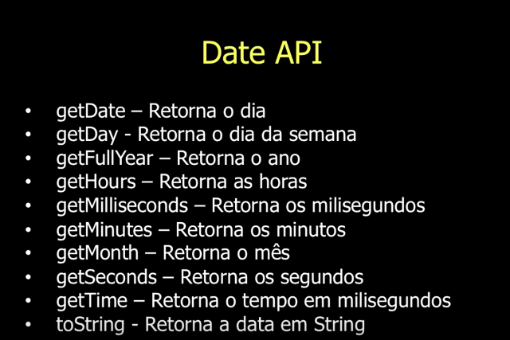

# Aula 11 - Date

## Date

Apesar de parecer mais simpes, a data **não é representada da forma literal como conhecemos**...

- Como assim?

Ela é representada pela quantidade de milissegundos desde o início da **Era Unix**

A **Era Unix** (Unix Epoch), ou Posix Time, teve início no dia **1 de janeiro de 1970 às 00:00:00** do Tempo Universal Coordenado, mais conhecido como UTC, referência a partir de onde se calculam os fusos horários do mundo inteiro.

Existem **4 maneiras diferentes** de criar uma data!

- Criando uma data, a partir da função construtora de **Date**, sem parâmetros.

```js
var hoje = new Date();

hoje.getTime(); //1469580276589
```

- Crianduma data, passando como parâmetro o tempo em milissegundos.

```js
var natal = new Date(1419465600000);
```

- Criando uma data, passando como parâmetro uma String.

```js
new Date("2014/12/25");
//2014-12-25T03:00:00.000Z
new Date("12/25/2014");
//2014-12-25T03:00:00.000Z
new Date("25/12/2014");
// Invalid Date
```
>Cuidado, os formatos oficialmente aceitos são RFC 2822 ou ISO 8601

- Criando uma data, passando como parâmetro uma String RFC 2822

```js
new Date("Thu Dec 25 2014");
// Thu Dec 25 2014 00:00:00 GM-0200 (BRST)
new Date("Thu Dec 25 2014 10:30:00");
// Thu Dec 25 2014 10:30:00 GM-0200 (BRST)
```

- Criando uma data, passando como parâmetro uma String ISO 8601

```js
new Date("2014-12-25");
// Wed Dec 24 2014 22:00:00 GM-0200 (BRST)
new Date("2014-12-25T10:30:00");
// Thu Dec 25 2014 08:30:00 GM-0200 (BRST)
new Date("2014-12-25T10:00:00-02:00");
// Thu Dec 25 2014 10:00:00 GM-0200 (BRST)
```

- Criando uma data, passando como parâmetro a própria data.

```js
new Date(2014, 11, 25);
// Wed Dec 24 2014 00:00:00 GM-0200 (BRST)
new Date(2014, 11, 25, 10, 30, 0);
// Thu Dec 25 2014 10:30:00 GM-0200 (BRST)
```

## Date API

