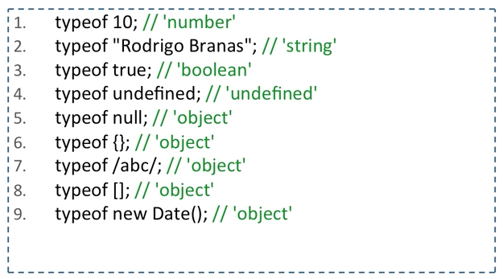
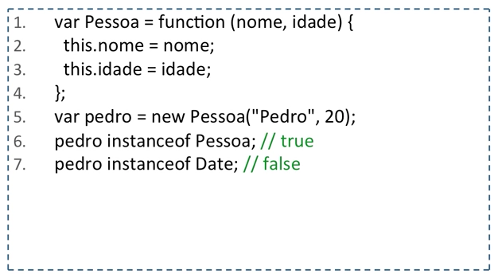
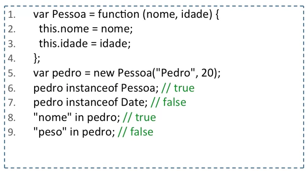
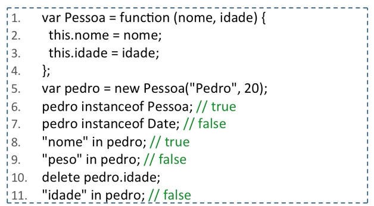

# Aula 12 - Operadores

## Operadores

Cuidado com os operadores de comparação igual **==** e diferente **!=**

O comportamento destes operadores pode produzir resultados inesperados por conta da **coersão de tipos**

- Exemplos:

```js
0 == ''
//true

0 == '0'
//true

false == undefined
//false

false == null
//false

null == undefined
//true

1 == true
//true

0 == false
//true

0 == '\n' //string com quebra de linha
//true
```

- Que mágica é essa chamada de coersão de tipos?

Quando fazemos a comparação entre dois operandos que tem tipos diferentes, como `10 == '10'`, temos que fazer a conversão de um dos dois operandos.

Se x é Number e y é String, a comparação será feita da seguinte forma: x == ToNumber(y). Como o resultado de ToNumber('10') é 10, **o retorno é true**.\

No caso de `null == undefined` se x é null e y é undefined, **o retorno é true**.

Outro caso:

`10 == new Number(10)` // Comparando um número com um objeto Number é true

Se x é Number e y é Object, a comparação será feita da seguinte forma: x == ToPrimitive(y), que utiliza a operação valueOf, ou toString se não existir o valueOf, do objeto para compará-lo com um Number. O retorno da operação valueOf nesse caso é 10, **sendo assim o retorno é true**

- Qual é a recomendação?

Utilize os operadores muito igual **===** e muito diferente **!==**

```js
10 === '10'
//false

1 === true
//false
```

**Mas não seja assim tão radical**, a coersão de tipo pode te ajudar.

- Como fazer para comparar dois objetos em JavaScript?

Cenário:

```js
var x = {};

var y = {};

x == y
//false

x === y
//false

var z = x

x == z
//true

x === z
//true
```
>O retorno é false porque mesmo sendo do tipo Object, as referências são diferentes. 

## Operadores Lógicos

Os operadores lógicos OU **||** e E **&&** também escondem seus segredos...

Além de ser **curto-circuito**, o retorno é **um de seus operandos**

Exemplos:

```js
0 || 2 
// é 2 | 0 é false

1 || 2
// é 1 | 1 é true e não avalia o 2

1 && 2 
// é 2 | 1 e true, então é avaliado o 2 e 2 é true, então retorno 2

0 && 2
// é 0 | 0 é false, então já retorna o 0
```

Quando avaliados situações boleanas, os tipos assumem valores truthy ou falsy por meio da operação obstrata ToBoolean

```js
!!0
//false

!!NaN
//false

!!"
//false

!!false
//false

!!null
//false

!!undefined
//false
```

Todos os outros são truthy por padrão, incluindo {} e []

- **Como você faria para inicializar a varáivel max no exemplo abaixo para tratar a questão do NaN?**

```js
var generateSerial = function(max){
    return Math.floor(Math.random()*max);
};

generateSerial(1000); // 897
generateSerial(100); // 90
generateSerial(10); // 7
generateSerial(); // NaN
```

RESPOSTAS 1:

```js
var generateSerial = function(max){
    if(max === undefined || max === null || max === 0){
        max = 1000; //Número que definimos para iniciarlizar.
    }
    return Math.floor(Math.random()*max);
};

generateSerial(1000); // 897
generateSerial(100); // 90
generateSerial(10); // 7
generateSerial(); // 127
```

RESPOSTA 2:

```js
var generateSerial = function(max){
    if(!max){ //Equivalente ao if acima
        max = 1000; //Número que definimos para iniciarlizar.
    }
    return Math.floor(Math.random()*max);
};

generateSerial(1000); // 897
generateSerial(100); // 90
generateSerial(10); // 7
generateSerial(); // 363
```

RESPOSTA 3:

```js
var generateSerial = function(max){
    max = max || 1000; //Se max tiver valor diferente de 0 ele vai retornar true e retornará ele mesmo. Se o max foi false, ele usará o 1000 para inicializar.
    return Math.floor(Math.random()*max);
};

generateSerial(1000); // 897
generateSerial(100); // 90
generateSerial(10); // 7
generateSerial(); // 582
```


### A linguagem ainda possui alguns operadores especiais...


>O typeof retorna o tipo do operando


>O instanceof verifica se o objeto possui a função construtora em sua cadeia de protótipos


>O in verifica se a propriedade faz parte do objeto


>O delete apaga a propriedade de um objeto

- **Por fim, os operadores mais normais e bem comportados!**

Operadores de comparação **<, >, <=, >=**

Operadores aritméticos **+, -, *, /, %**

Operadores de atribuição **+=, -=, *=, /=, %=**

Operador de incremento e decremento **++** e **--**

Operador ternário **(expressão) ? true : false** 