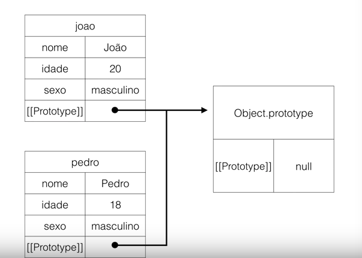
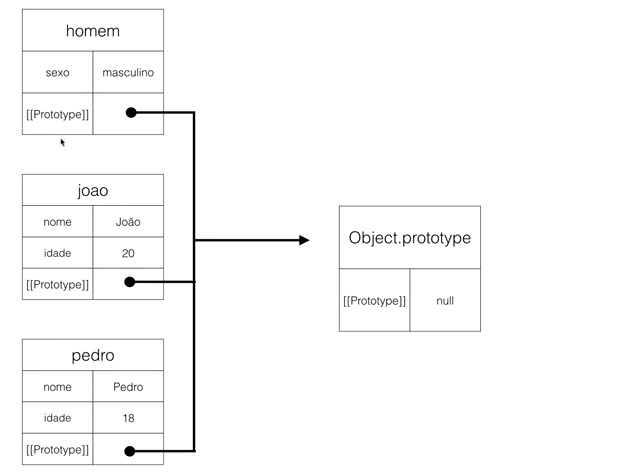
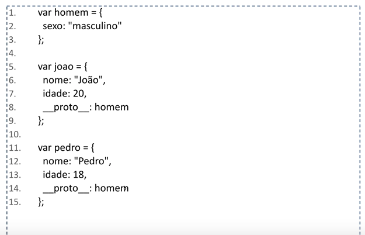
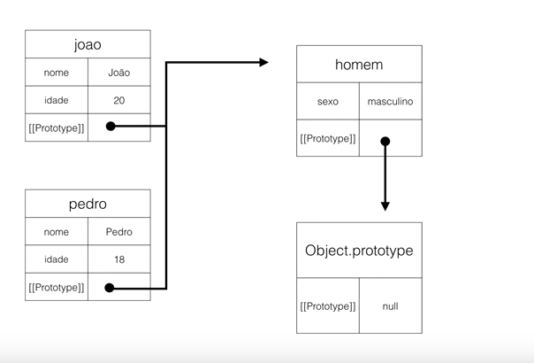
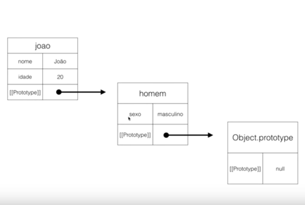
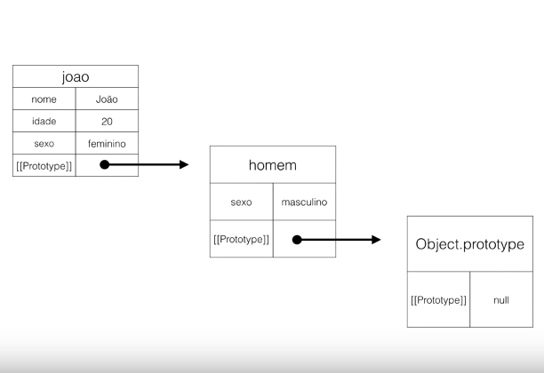

# Aula 14 - Herança (Parte 1)

## Herança

Um objeto é uma coleção dinâmica de chaves e valores, que podem ser de qualquer tipo, e um protótipo que pode ser um objeto ou null.

Em JavaScript objetos herdam de outros objetos.

```js
var joao = {
    nome: "João",
    idade: 20,
    sexo: "masculino"
};

var pedro = {
    nome: "Pedro",
    idade: 18,
    sexo: "masculino"
};
```

Ao criar este dois objetos, podemos reparar que o protótipo deles é o mesmo.



Todo objeto em Javascript tem um protótipo.

Imagina que agora a gente queira eliminar a propriedade sexo dos dois objetos e queira generalizar. Criamos então o objeto homem que será quem define a propriedade sexo "masculino".

```js
var homem = {
    sexo: "masculino"
};

var joao = {
    nome: "João",
    idade: 20,
};

var pedro = {
    nome: "Pedro",
    idade: 18,
};
```

Agora temos que fazer de algum jeito os objetos `joão` e `pedro` apontarem para o objeto `homem`, assim eles conseguem herdar essa propriedade sexo.




A propriedade **__proto__** é uma referência para o protótipo do objeto. Essa propriedade nos dá a referência para o protótipo do objeto.



Dessa forma, a estrutura da nossa herança também se altera.



```js
var homem = {
    sexo: "masculino"
};

var joao = {
    nome: "João",
    idade: 20,
    __proto__:homem
};

var pedro = {
    nome: "Pedro",
    idade: 18
};

console.log(joao);
console.log(joao.sexo);
console.log(pedro);
console.log(pedro.sexo);

//{ nome: 'João', idade: 20 }
//masculino
//{ nome: 'João', idade: 20 }
//undefined
```

**CUIDADO**

**__proto__** não é padrão e pode não funcionar em alguns interpretadores.

Por isso, prefira a utilização de **Object.getProtorypeOf** e **Object.setPrototypeOf** para interagir com o protótipo do objeto.

```js
var homem = {
    sexo: "masculino"
};

var joao = {
    nome: "João",
    idade: 20,
    __proto__:homem
};

var pedro = {
    nome: "Pedro",
    idade: 18
};

Object.setPrototypeOf(pedro, homem);

console.log(joao);
console.log(joao.sexo);
console.log(pedro);
console.log(pedro.sexo);

//{ nome: 'João', idade: 20 }
//masculino
//{ nome: 'João', idade: 20 }
//masculino
```

Também é possível utilizar **Object.create** para determinar o protótipo do objeto.

```js
var homem = {
    sexo: "masculino"
};

var joao = Object.create(homem);
joao.nome = "João",
joao.idade = 20;

var pedro = {
    nome: "Pedro",
    idade: 18
};

Object.setPrototypeOf(pedro, homem);

console.log(joao);
console.log(joao.sexo);
console.log(pedro);
console.log(pedro.sexo);

//{ nome: 'João', idade: 20 }
//masculino
//{ nome: 'João', idade: 20 }
//masculino
```



### Shadowing (sombra)

Imagine o cenário abaixo: 

```js
var homem = {
    sexo: "masculino"
};

var joao = {
    nome: "João",
    idade: 20,
    sexo: "feminino"
};

console.log(joao);
console.log(joao.sexo);

//{ nome: 'João', idade: 20, sexo: 'feminino' }
//feminino
```

Por que isso acontece?

Isso acontece porque uma vez que já tenha a propriedade não é preciso ir buscar nos protótipos, então até em termos de performance vai ser melhor. O intepretador sempre vai dar preferência a primeira propriedade que ele encontrar. 

Quando falamos de Shadowing, é porque esse propriedade sexo de joao faz sombra para a propriedade sexo de homem.

