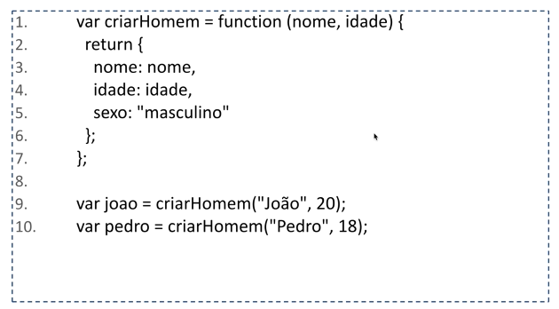
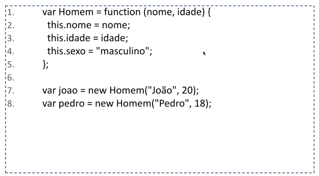
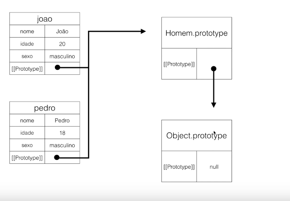

# Aula 15 - Herança (Parte 2)

## Herança

- Criando objetos com uma função fábrica.



O operador new cria um novo objeto por meio de uma função construtora.

- Criando objetos com uma função construtora. 



```js
var Homem = function(nome, idade) {
    this.nome = nome;
    this.idade = idade;
    this.sexo = "masculino";
};

var joao = new Homem("João", 20);
console.log(joao);

var pedro = {};
Homem.call(pedro, "Pedro", 18);
console.log(pedro);
```

Quando utilizamos  o new Homem:



Como vimos anteriormente, todo objeto tem como protótipo o Object.prototype. Mas por que Object.prototype e não só Object?

**Porque Object é uma função construtora**

### Pesquisar mais a respeito de Herança.