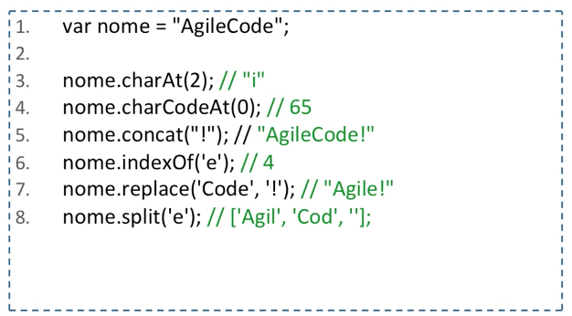
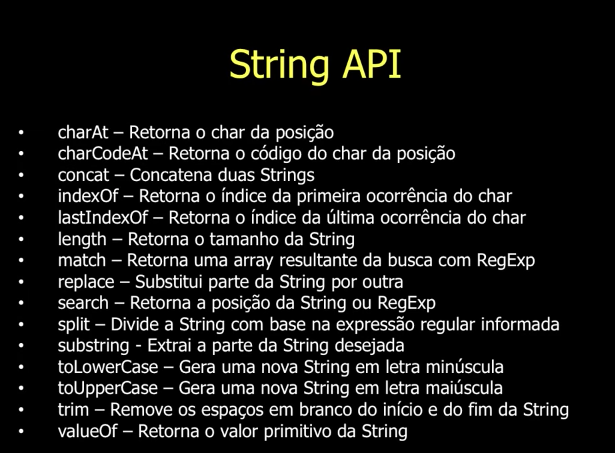

# Aula 03 - Tipos de Dados (String)

## String

- Uma String é composta por uma sequência de 0 ou mais caracteres com as seguintes características:

	* São imutáveis

	* Podem ser declaradas com aspas simples ou duplas

### Criando uma String

## String API

