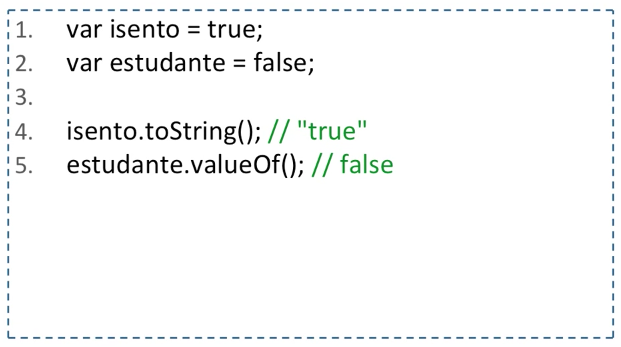
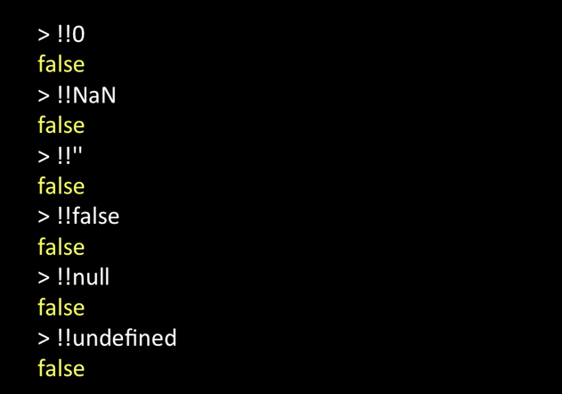

# Aula 04 - Tipos de Dados (Boolean)

## Boolean

- True e False são palavras reservadas. Não podem ser usadas para criar qualquer identificados/variável.

- Cuidado com os perigosos e confusos tipos truthy e falsy

- A linguagem Javascript assume o estado de determinados tipos como true ou false, dependendo do caso. 

### Criando um Boolean

### Valores avaliados como falsos quando estão em uma posição Booleana

PS: Todos os outros são truthy por padrão.
