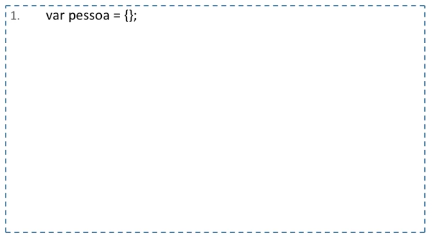
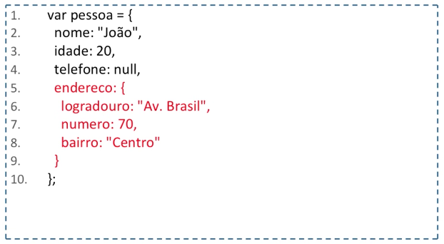
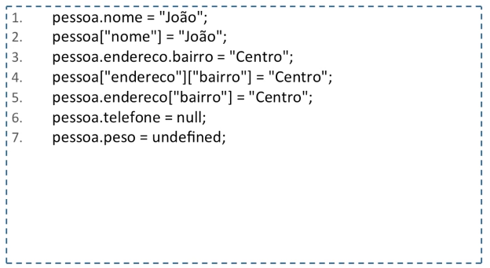
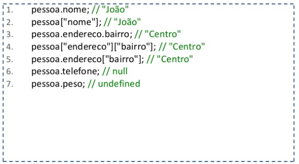
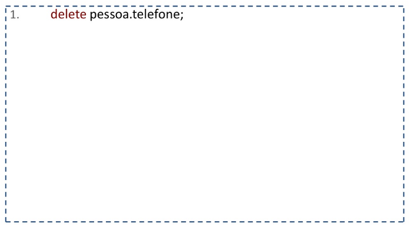

# Aula 06 - Tipos de Dados (Object)

## Object

- Um objeto em Javascript é uma coleção dinâmica de chaves e valores de qualquer tipo de dado.

- É possível adicionar e remover propriedades a qualquer momento.

- Em Javascript temos a criação dinâmica de novos objetos que são criados independente da existência de qualquer tipo de classe. 

- Em Javascript não há o conceito de construtor, classe e método propriamente dito.

### Criando um Object

### Adicionando propriedades ao objeto

### Atribuindo propriedades a um objeto

## Acessando as propriedades de um objeto

## Apagando propriedades de um objeto

