# Aula 07 - Function (Parte 1)

## Function

- A linguagem Javascriot não tem:

	* Classe

	* Construtor

	* Método

	* Módulo

	* Mas tem Função!

- As funções são responsáveis pelo poder da linguagem Javascript pois são capazes de simular todos os elementos acima. 

- Uma função é um objeto que **contém um bloco de código executável**.

- Esse bloco é **isolado**, não sendo possível acessá-lo externamente. 

	* A função é o tipo de estrutura que vai conferir encapsulamento à linguagem Javascript.

- Na linguagem Javascript, as funcões são de **primeira classe**.
	
	* Função de primeira classe é aquela que pode ser **atríbuida a uma variável, passada como parâmetro** ou ser **retornada de uma outra função**.

	* Isso oferece um grande poder em reuso de código.

### Criando funções

- Function Declaration

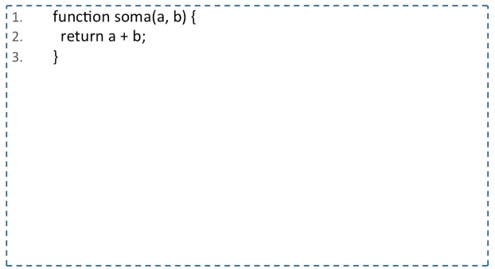

- Function Expression

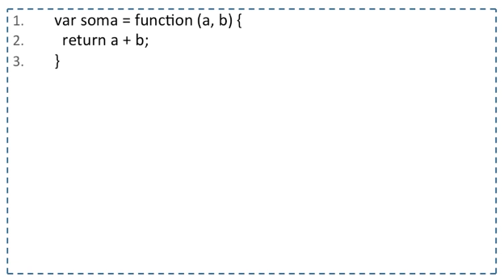

- Named Function Expression

	* O nome da função pode ser útil pois aparece no stack trace, listas de breakpoints e demais ferramentas de debbuging.

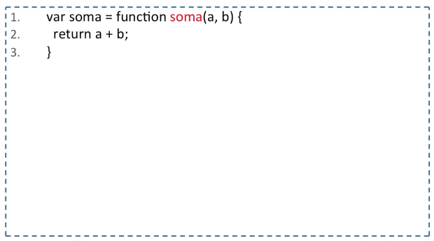

### Qual é a diferença entre function **declaration** e **expression**?

- Function Declaration: **A função é carregada antes do código ser interpretado**

```
soma(2, 2) //4

function soma(a, b) {
	return a + b;
}
```

- Function Expression: **A função é carregada durante a interpretação do código**

```
soma(2, 2) //soma is not defined

var soma = function(a, b) {
	return a + b;
}
```

## Invocando uma função

### Invocando uma função diretamente no escopo **global**

- Invocando uma função **diretamente**

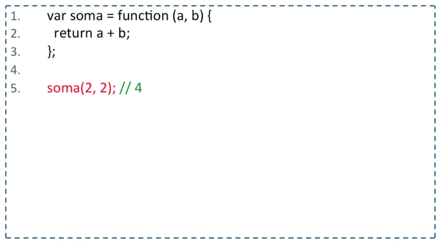

- Invocando uma função como **parâmetro**

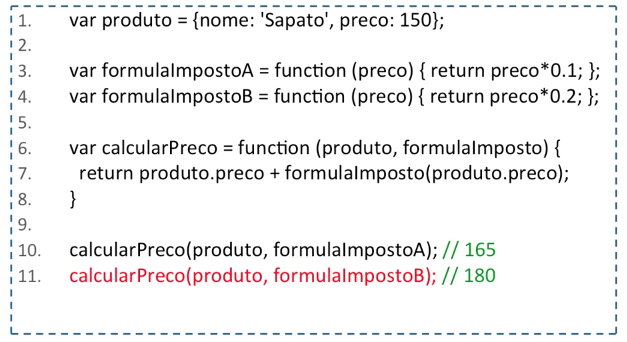

PS: É muito comum passar funções por parâmetro. Isso é conhecido como Lambda.

- Invocando o **retornando** de uma função

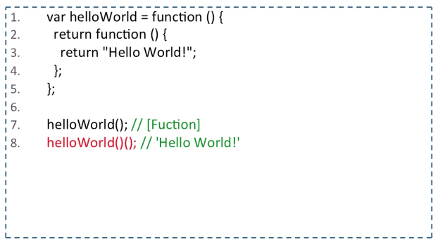


### Invocando uma função por meio de um **Objeto**

- Utilizando uma função como método, declarada dentro do objeto.

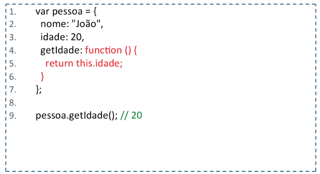

- Utilizando uma função externalizada dentro do objeto.

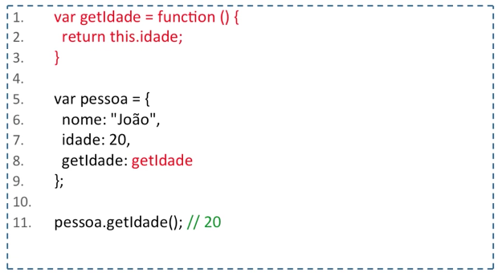


### Invocando uma função com **call** e **apply**

- **call e apply**

	* Toda função possui os métodos call() e apply().

	* Eles são utilizados para indicar em qual escopo uma função deve ser executada.

	* A diferença é basicamente a forma como é utilizado:

		* função.call(escopo, parametro1, parametro2)

		* função.apply(escopo, parametros)

- Invocando uma função com call

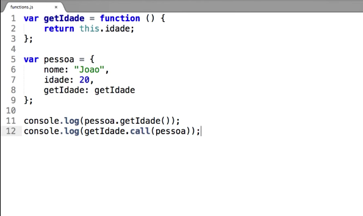

- Invocando uma função com apply

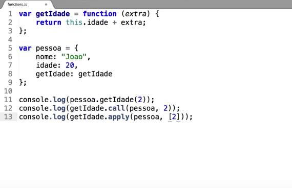

	* No apply os parâmetros são passados como um array.


### Invocando uma função por meio do operador **new**

- Funções Fábrica vs. Funções Construtora

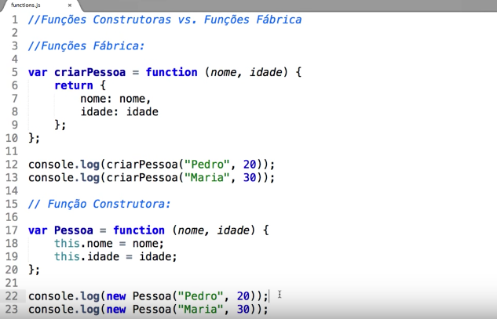

- **Não esqueça de utilizar o operador new quando utilizar funções construtoras**


### Closures 

- Significado: Encerramento, fechamento, encarceramento.. 

- Retornando uma função dentro de outra função

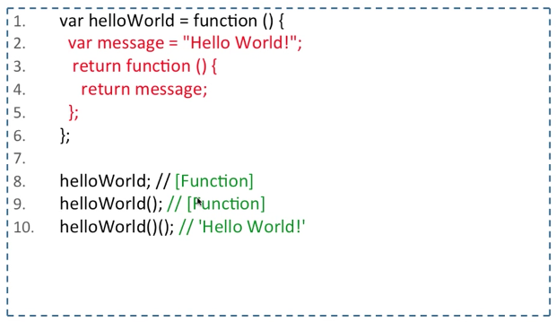

