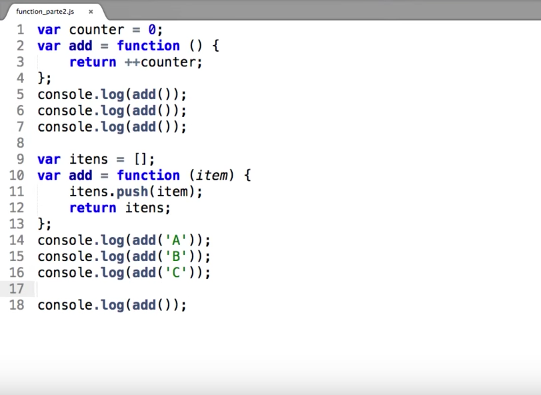
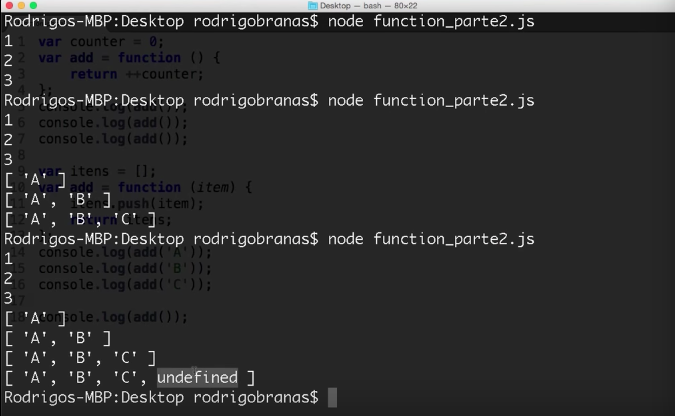
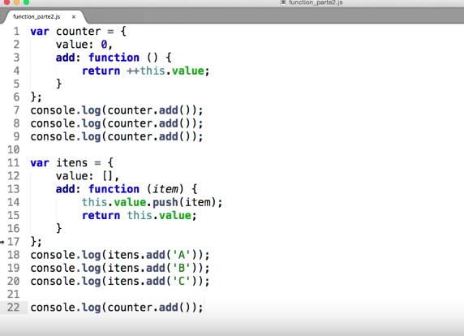
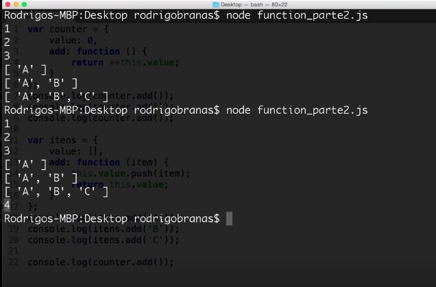
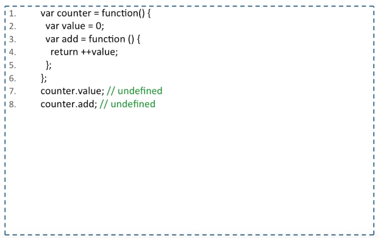
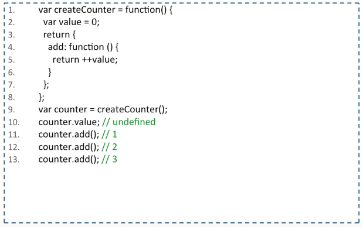
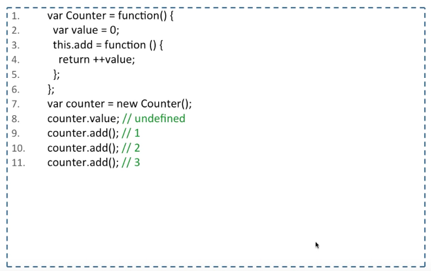
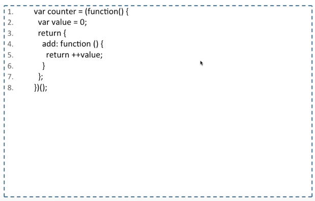
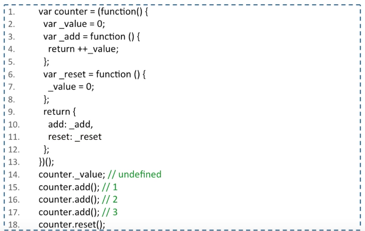

# Aula 07 - Function (Parte 2)

## Function

- Cuidado com o escopo **global**

Exemplo: 

- O grande problema com o escopo global é que ele pode ficar **poluído**.

- Por que nós declaramos tanta coisa no escopo global?

	* Como a linguagem não possui um **ligador**, ou **linker**, faz uso de um escopo global compartilhado para estabeler os vínculos entre diferentes partes de uma aplicação.

- Como fazer para **encapsular**?

	* Umas da técnicas seria usar um Object

	

	

PS: Um objeto em Javascript nada mais é do que uma coleção dinâmica de chaves e valores de qualquer tipo de dado.

- A linguagem Javascript não possui modificadores de visibilidade como **private**, **public** e **protected**

	* Outra técnica seria por meio de Function

	

	- Como fazer para e **comunicar** com o mundo exterior?

		* Por meio de uma Factory Function
			* A Factory Function vai adicionar um return (linha 3) para expor aquilo que queremos que seja público.

	

		* Uma variação disso seria o uso de Constructor Function

	

PS: Uma função é um objeto que **contém um bloco de código executável**. Forma uma bloco **isolado**, não sendo possível acessá-lo externamente.

PS: Uma boa convenção da linguagem é prefixar tudo que for privado com um _. Ex: var _value = 0;

	* Outra técnica seria o uso de uma Expressão de Função Imediatamente Invocada (Immediately-Invoked Function Express)

		* Module Pattern

	

		*Revealing Module Pattern

	

## DICA

[Livro Javascript Design Patterns do Addy Osmani](http://letanure.github.io/blog/2013/08/19/javascript-design-patterns-livro-gratuito/)