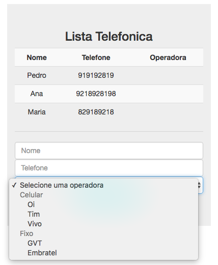

# Aula 03 - Usando Diretivas - Parte 2

## Diretivas

Relembrando: Diretivas são extensões da linguagem HTML que permitem a implementacão de novos comportamentos, de forma declarativa.

### ngDisabled
Atua desabilitando um elemento dinamicamente. É possível passar como valor uma expressão.

Comportamento padrão
```html
<button class="btn btn-primary btn-block" ng-click="adicionarContato(contato)" ng-disabled="true">Adicionar Contato</button>
```

Passando uma expressão
```html
<button class="btn btn-primary btn-block" ng-click="adicionarContato(contato)" ng-disabled="!contato.nome || !contato.telefone">Adicionar Contato</button>
```


### ngOptions
Renderiza as opções de um select. Ela aceita uma expressão. Existem três formas de utilizar o ng-options: com os atributos **for, as e group by**

1ª forma de usar o ng-options:
```html
<select class="form-control" ng-model="contato.operadora" ng-options="operadora.nome for operadora in operadoras">
    <option value="">Selecione uma operadora</option>
</select>
```

Observa-se o uso do ng-model. Se não usarmos o ng-model, o ng-options não tem razão de existir, porque a única razão do ng-options é fazer com que a opção seja selecionada e atribuita ao $scope. Sendo o ng-model responsável por atribuir uma propriedade ao $scope.

O ng-options tem uma estrutura similar ao ng-repeat. Porém, precisamos também dizer qual atributo queremos que seja exibido utilizando o `operadora.nome for ...`


2ª forma de usar o ng-options:
```html
<select class="form-control" ng-model="contato.operadora" ng-options="operadora.codigo as operadora.nome for operadora in operadoras">
    <option value="">Selecione uma operadora</option>
</select>
```

O trecho `operadora.codigo as ...` diz que nosso value será o valor do código, enquanto que o label do select será o nome. Se não definirmos isso, por padrão o value também seria o valor de `operadora.nome`.


3ª forma de usar o ng-options: usando group by
```html
<select class="form-control" ng-model="contato.operadora" ng-options="operadora.nome group by operadora.categoria for operadora in operadoras">
    <option value="">Selecione uma operadora</option>
</select>
```

O resultado será o seguinte: Nossos elementos serão agrupados de acordo com o atributo definido no group by e definidos na própriedade do nosso $scope.




### ngClass e ngStyle
Atua aplicando classes CSS e estilos dinamicamente.

**ngClass** 
Escrita: `ng-class="nome_variavel_do_escopo"`

*1ª forma de utilizar o ng-class*
Se tivermos dentro do nosso escopo a propriedade passada dentro do `ng-class` da nossa View, ele irá atribuir dinamicamente a classe definida. 

**Exemplo:**

```js
$scope.classe = "selecionado";
```

```html
<div ng-class="classe"></div>
```

```css
.seleciona {
    background: yellow;
}
```

*2ª forma de utilizar o ng-class*
A segunda forma possível é utilizando um array de propriedades.

**Exemplo:**

```js
$scope.classe1 = "selecionado";
$scope.classe2 = "negrito";
```

```html
<div ng-class="[classe1, classe2]"></div>
```

```css
.selecionado {
    background: yellow;
}
.negrito {
    font-weight: bold;
}
```

*3ª forma de utilizar o ng-class*
Aplicando a propriedade com base em um evento. Onde uma classe só será aplicada quando algo acontecer. 

**Exemplo:**

```js
$scope.classe1 = "selecionado";
$scope.classe2 = "negrito";
```

```html
<tr ng-class="{selecionado: contato.selecionado, negrito: contato.selecionado}">
    <td><input type="checkbox" ng-model="contato.selecionado"></td>
</tr>
```

```css
.selecionado {
    background: yellow;
}
.negrito {
    font-weight: bold;
}
```

2ª formas de selecionar a propriedade com o ng-class utilizando um objeto:
```html
<tr ng-class="{selecionado: contato.selecionado, negrito: contato.selecionado}">
```

### e

```html
<tr ng-class="{'selecionado negrito': contato.selecionado}">
```


**ngStyle** 
O ng-style é muito similar ao ng-class, só que ele aplica uma cor, ou aplica uma largura, ou aplica uma altura... ele aplica alguma coisa mais específica. 


### ngShow, ngHide e ngIf
Atuam exibindo um elemento condicionalmente. 

O ngIf remove ou adicona algo na DOM. O ngShow e o ngHide apenas mudam o display do elemento, mas ele continua existindo na DOM.


### ngInclude
Serve para incluir conteúdo dinamicamente.

Para funcionar deve usar um servidor, caso contrário a ação será bloqueada por ser uma requisição AJAX.